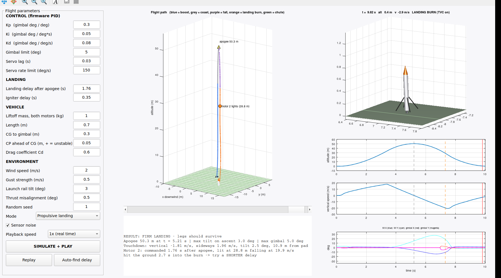
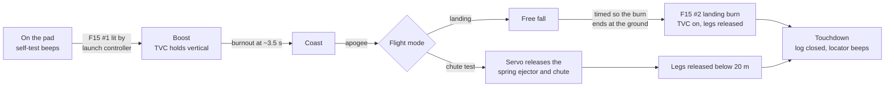

# Self-Landing TVC Rocket

This is my build log and source repository for a 3-inch model rocket that steers itself with a thrust-vectored motor and is designed to land on its own legs. Everything is here: the custom flight computer (RocketFC), the 3D-printed avionics bay, the servo-driven parachute ejector, the flight software, and the simulators I use to test ideas before flying them.

**Current status:** Flight computer v2.1 is ordered from JLCPCB, fully assembled. The firmware is written and has been tested in simulation. The avionics bay and chute ejector are designed and ready to print. Next up is bench testing once the boards arrive, followed by a first flight using the parachute.

| Flight computer (top) | Avionics bay | 3D flight simulator |
|---|---|---|
|  |  |  |

---

## Mission profile



## What's in this repo

| Folder | Contents | Start here |
|---|---|---|
| [`hardware/flight-computer`](hardware/flight-computer) | RocketFC v2.1, a 70 mm round 4-layer PCB designed in KiCad | `rocket_fc.kicad_pro`, plus Gerbers, BOM and CPL in `fabrication/` |
| [`hardware/avionics-bay`](hardware/avionics-bay) | Printed sled for the Apogee 3" tube, held in place by 8 radial M3 screws | STL and STEP files, tube drill template |
| [`hardware/chute-ejector`](hardware/chute-ejector) | Spring-loaded piston released by a servo-driven latch | Print-ready STLs |
| [`firmware/RocketFC`](firmware/RocketFC) | Arduino Nano flight software: TVC control, flight events, SD logging | `RocketFC.ino` |
| [`simulation/matlab`](simulation/matlab) | Interactive 3D flight simulator for tuning the PID gains and landing delay | `rocketSim3D.m` |
| [`simulation/firmware-sim`](simulation/firmware-sim) | Runs the actual flight firmware on a PC against simulated sensors | `sim.cpp` |
| [`LOG.md`](LOG.md) | Engineering log with a dated entry for each work session | |

## Flight computer overview

```
2S LiPo (XT30) ──┬── diode ── POWER switch ── Nano VIN + 3.3 V (sensors, SD card)
                 ├── 5 V 3 A buck, enabled by the switch ── 3 servos + buzzer
                 └── ARM plug (XT30) ── 4 low-side pyro channels (WAGO lever terminals)
```

| Function | Nano pin | Notes |
|---|---|---|
| Pyro P1 ascent, P2 landing, P3 legs, P4 spare | D2, D4, D6, D8 | AO3400A MOSFETs with 100k gate pull-downs; only live when the ARM plug is in |
| Continuity P1 to P4 | A0 to A3 | About 2.1 V when armed with an igniter connected, about 1.2 V when disarmed, 0 V when open |
| Servo X, servo Y (TVC), AUX (chute) | D3, D5, D7 | Powered from a separate 5 V buck converter |
| Battery and arm sense | A6, A7 | Battery voltage = A6 reading × 4.03 |
| IMU LSM6DSO32 (±32 g) and barometer MS5607 | I²C at 0x6A and 0x77 | Level-shifted to the 5 V Nano |
| microSD card (hinged lid) | SPI, D10 to D13 | Buffered through a 74LVC125 |
| Buzzer | D9 | Magnetic transducer, so it needs a tone rather than a steady signal |

Before ordering, the design passed a full design rule check with no errors, a pad-by-pad comparison between the schematic and the PCB (282 of 282 connections matched), an electrical rules check with no errors, and all 34 BOM lines were matched to parts in stock at JLCPCB.

## Key numbers

| | |
|---|---|
| Body tube | Apogee 3" (74.47 mm inner diameter); the bay and sled are 74.0 mm |
| Motors | 2 × Estes F15 (49.6 N·s total impulse, 25.3 N peak, 3.45 s burn) |
| Battery | 2S LiPo, 1000 mAh, 70 × 35 × 18 mm, XT30 connector |
| Simulated apogee at 1.0 kg | About 50 m |
| Best simulated landing delay | 1.76 s after apogee, with a window of roughly ±0.01 s |

## Links

- Onshape model of the avionics bay: [RocketFC Avionics Bay (3in Apogee tube)](https://cad.onshape.com/documents/a77bffe2781b56247ce74af7/w/bac2e3535b987d098c97ed26/e/773c68a36321aff5911a4cc4)

## Roadmap

- [x] Design, verify and order the flight computer PCB
- [x] Design the avionics bay and chute ejector
- [x] Write the firmware, compile it for the ATmega328P and test it in simulation
- [x] Build the 3D flight simulator in MATLAB
- [ ] Bench test the boards when they arrive: sensors, servos, and a pyro test with a small bulb
- [ ] Print the bay and ejector and test fit them in the tube
- [ ] Static test to measure the F15 igniter delay (`fire2` command)
- [ ] Flight 1: parachute mode with TVC on the way up
- [ ] Tune the PID gains using the flight logs
- [ ] Flight 2 and beyond: propulsive landing attempts
