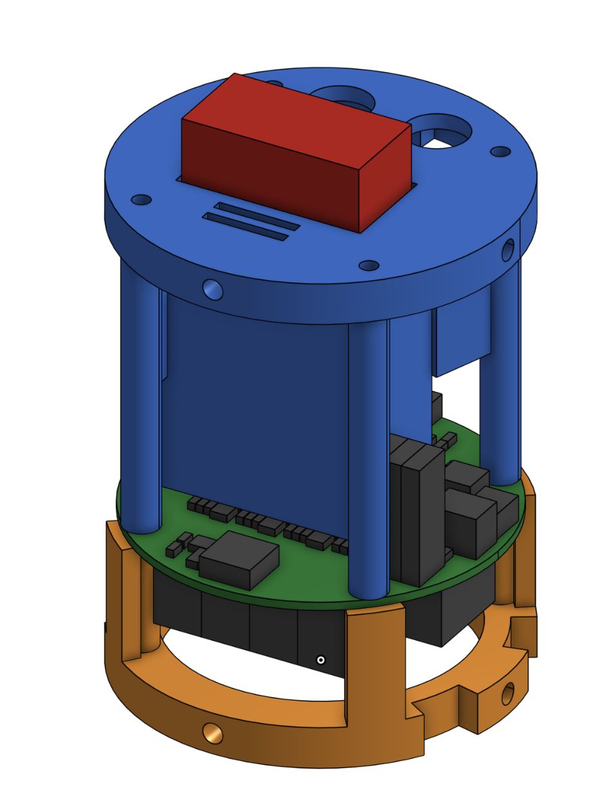

# Avionics bay (Apogee 3" tube)

Print `AvBay_Aft.stl` and `AvBay_Forward.stl` in PETG. Joined by 4 × M3 × ~100 mm rods through the PCB holes (nut traps in the aft face).
8 × M3 heat-set inserts (4.0 mm hole) in radial bosses; drill the tube with `AvBay_Tube_Drill_Template.pdf` (print at 100 %).
Onshape: https://cad.onshape.com/documents/a77bffe2781b56247ce74af7/w/bac2e3535b987d098c97ed26/e/773c68a36321aff5911a4cc4

