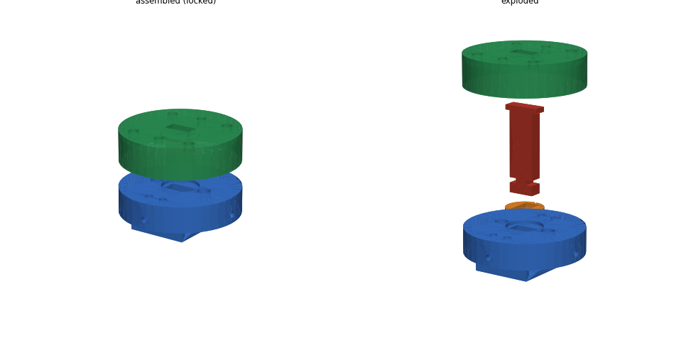

# Servo parachute ejector

A compression spring (22 mm OD, 1.4–1.5 mm wire, 100 mm free, compressed to 35 mm) pushes a piston that throws out the chute.
A T-headed stem through the bulkhead is held by a latch cup on an MG90S servo horn; turning 90° lines up the slots and releases it.
The spring load goes into the cup and bulkhead, not the servo.

Print (PETG, no supports): `Print_Chute_Bulkhead.stl`, `Print_Chute_LatchCup.stl`, `Print_Chute_Stem.stl`, `Print_Chute_Piston.stl`.
Hardware: MG90S, 4 × M3 × 8 + heat-set inserts, M2 servo screws, Kevlar shock cord.
Arming: `open` → push the piston down until the T-head drops into the cup → `lock`.

