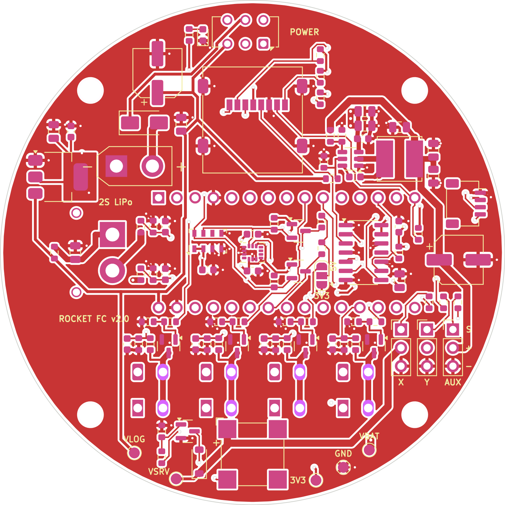
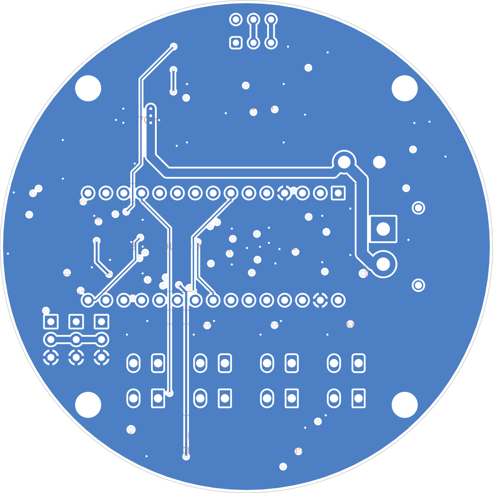

# RocketFC v2.1 flight computer PCB

Open `rocket_fc.kicad_pro` in KiCad 7 or newer.

- `fabrication/` holds exactly what was sent to JLCPCB: the Gerbers plus the full-assembly BOM and CPL files.
- `scripts/` has the Python scripts used to generate the schematic and board. `design.py` is the single source of truth for every part and net.
- `lib/` contains a local footprint for the WAGO 2601 lever terminals.

JLCPCB settings used: 4 layers, 1.6 mm, ENIG, Standard PCBA, assembly on both sides, parts placement confirmation, and depaneling.

When bringing up a new board, check the test pads first. VLOG should read about 7.9 V, VSRV 5.0 V and 3V3 3.3 V.

 
