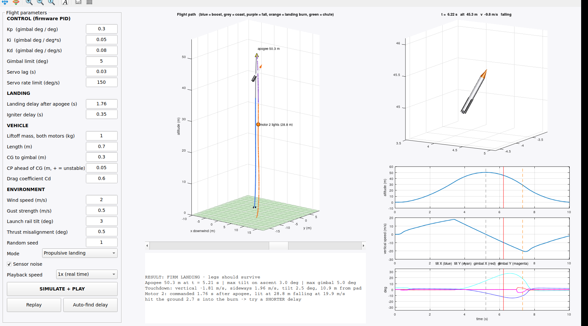

# Simulation

**`matlab/rocketSim3D.m`** runs in MATLAB, MATLAB Online or GNU Octave. Type `rocketSim3D`, adjust the PID gains, landing delay, mass or wind, and press SIMULATE + PLAY. The Auto-find button searches for the landing delay that gives the softest touchdown.

**`firmware-sim/`** compiles the real `RocketFC.ino` on a regular computer and runs it against simulated sensors:

```
g++ -O1 -w -Istub -o sim sim.cpp -lm
./sim 0    # 0 = chute flight, 1 = bump on the pad, 2 = landing
```


